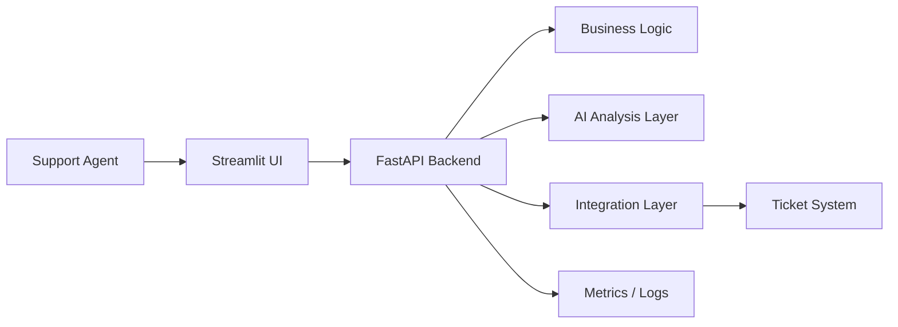

# Architecture

```mermaid
flowchart LR
    U[Support Agent] --> UI[Streamlit UI]
    UI --> API[FastAPI Backend]
    API --> BL[Business Logic]
    API --> AI[AI Analysis Layer]
    API --> INT[Integration Layer]
    INT --> TS[Ticket System]
    API --> OBS[Metrics / Logs]
```

This is intentionally simple. Do not add distributed queues, Kubernetes, vector databases, or multiple agents before the customer problem requires them.
